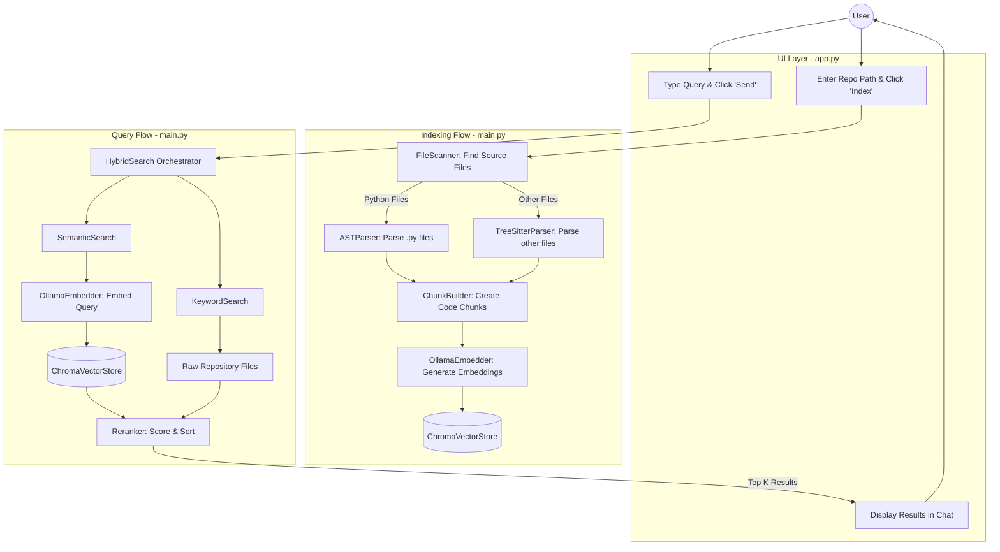

# Code Next AI: End-to-End Flow

This document explains the end-to-end architecture and data flow of the `coding-agent` application, from uploading a repository for indexing to querying it for answers.

## Architecture Diagram

## Step-by-Step Flow Explanation

### 1. Uploading and Indexing a Repository
When you select a repository path and click **"Index Repository"**:
1. **Scanning**: The `FileScanner` walks through the selected directory and identifies valid source code files.
2. **Parsing**: Depending on the file type, a parser extracts meaningful symbols (like functions, classes, etc.):
   - Python files (`.py`) are parsed using `ASTParser`.
   - Other supported files are parsed using `TreeSitterParser`.
3. **Chunking**: The `ChunkBuilder` takes these extracted symbols and breaks the code down into manageable chunks.
4. **Embedding**: The `OllamaEmbedder` generates a vector embedding for each code chunk. These embeddings capture the semantic meaning of the code.
5. **Storage**: Finally, the chunks and their corresponding embeddings are stored in `ChromaVectorStore` (ChromaDB) for fast vector retrieval later.

### 2. Asking a Question
When you type a question and click **Send**:
1. **Hybrid Search Initiation**: The query is passed to `HybridSearch`, which orchestrates both semantic and keyword-based searches to ensure comprehensive results.
2. **Semantic Search**:
   - The user's query is converted into a vector embedding using `OllamaEmbedder`.
   - `ChromaVectorStore` is queried to find code chunks with embeddings most similar to the query's embedding.
3. **Keyword Search**:
   - Simultaneously, `KeywordSearch` performs a lexical search directly against the raw repository files to find exact matches for terms in the query.
4. **Reranking**:
   - The results from both the Semantic and Keyword searches are combined.
   - The `Reranker` scores and sorts these combined results to ensure the most relevant code chunks are ranked highest.
5. **Display**: The top resulting code chunks (Top K) are formatted into Markdown (including file paths, line numbers, and code snippets) and displayed back to you in the UI chat interface (`app.py`).
